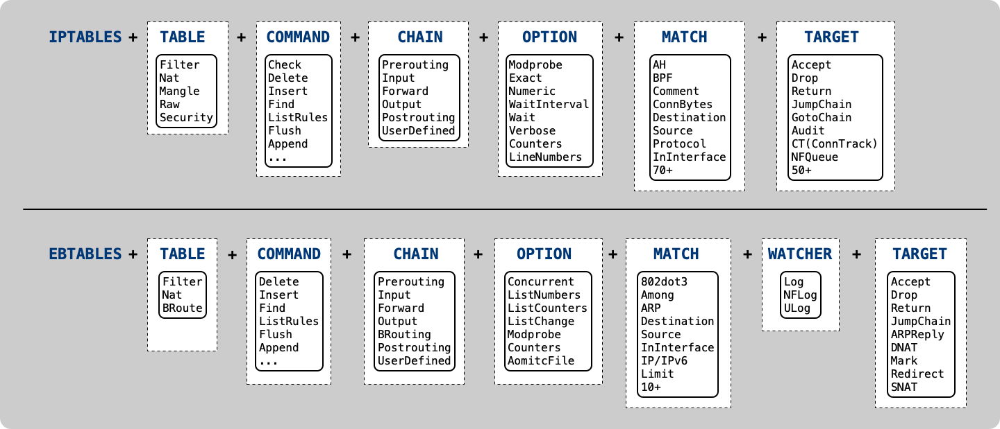

<p align=center>

</p>

<div align="center">

[](https://pkg.go.dev/badge/github.com/singchia/go-xtables)
[](https://github.com/singchia/go-xtables/actions/workflows/go.yml)
[](https://opensource.org/licenses/Apache-2.0)
[](https://goreportcard.com/report/github.com/singchia/go-xtables)


English | [简体中文](./README_cn.md)

</div>

## What is go-xtables?

### Concepts



### Capabilities

Go-xtables is a wrapper for the iptables, ebtables, and arptables utils. It provides full features, extensions and abstractions from Netfilter, making it very convenient to use.

Check out the [iptables godoc](https://pkg.go.dev/github.com/singchia/go-xtables/iptables) and [ebtables godoc](https://pkg.go.dev/github.com/singchia/go-xtables/ebtables)  to learn about the 70+ ```match``` capabilities, 50+ ```target``` capabilities, and 10+ ```option``` capabilities.

**Matches:**

- :white_check_mark: MatchTypeAddrType
- :white_check_mark: MatchTypeAH
- :white_check_mark: MatchTypeBPF
- :white_check_mark: MatchTypeCGroup
- :white_check_mark: MatchTypeCluster
- :white_check_mark: MatchTypeComment
- :white_check_mark: MatchTypeConnBytes
- :white_check_mark: MatchTypeConnLabel
- :white_check_mark: MatchTypeConnLimit
- :white_check_mark: MatchTypeConnMark
- :white_check_mark: MatchTypeConnTrack
- :white_check_mark: MatchTypeCPU
- :white_check_mark: MatchTypeDCCP
- :white_check_mark: MatchTypeDestination
- :white_check_mark: MatchTypeDevGroup
- :white_check_mark: MatchTypeDSCP
- :white_check_mark: MatchTypeDst
- :white_check_mark: MatchTypeECN
- :white_check_mark: MatchTypeESP
- :white_check_mark: MatchTypeEUI64
- :white_check_mark: MatchTypeFrag
- :white_check_mark: MatchTypeHashLimit
- :white_check_mark: MatchTypeHBH
- :white_check_mark: MatchTypeHelper
- :white_check_mark: MatchTypeHL
- :white_check_mark: MatchTypeICMP
- :white_check_mark: MatchTypeInInterface
- :white_check_mark: MatchTypeIPRange
- :white_check_mark: MatchTypeIPv4
- :white_check_mark: MatchTypeIPv6
- :white_check_mark: MatchTypeIPv6Header
- :white_check_mark: MatchTypeIPVS
- :white_check_mark: MatchTypeLength
- :white_check_mark: MatchTypeLimit
- :white_check_mark: MatchTypeMAC
- :white_check_mark: MatchTypeMark
- :white_check_mark: MatchTypeMH
- :white_check_mark: MatchTypeMultiPort
- :white_check_mark: MatchTypeNFAcct
- :white_check_mark: MatchTypeOSF
- :white_check_mark: MatchTypeOutInterface
- :white_check_mark: MatchTypeOwner
- :white_check_mark: MatchTypePhysDev
- :white_check_mark: MatchTypePktType
- :white_check_mark: MatchTypePolicy
- :white_check_mark: MatchTypeProtocol
- :white_check_mark: MatchTypeQuota
- :white_check_mark: MatchTypeRateEst
- :white_check_mark: MatchTypeRealm
- :white_check_mark: MatchTypeRecent
- :white_check_mark: MatchTypeRPFilter
- :white_check_mark: MatchTypeRT
- :white_check_mark: MatchTypeSCTP
- :white_check_mark: MatchTypeSet
- :white_check_mark: MatchTypeSocket
- :white_check_mark: MatchTypeSource
- :white_check_mark: MatchTypeSRH
- :white_check_mark: MatchTypeState
- :white_check_mark: MatchTypeStatistic
- :white_check_mark: MatchTypeString
- :white_check_mark: MatchTypeTCP
- :white_check_mark: MatchTypeTCPMSS
- :white_check_mark: MatchTypeTime
- :white_check_mark: MatchTypeTOS
- :white_check_mark: MatchTypeTTL
- :white_check_mark: MatchTypeU32
- :white_check_mark: MatchTypeUDP

**Targets:**

- :white_check_mark: TargetTypeAccept
- :white_check_mark: TargetTypeDrop
- :white_check_mark: TargetTypeReturn
- :white_check_mark: TargetTypeJumpChain
- :white_check_mark: TargetTypeGotoChain
- :white_check_mark: TargetTypeAudit
- :white_check_mark: TargetTypeCheckSum
- :white_check_mark: TargetTypeClassify
- :white_check_mark: TargetTypeClusterIP
- :white_check_mark: TargetTypeConnMark
- :white_check_mark: TargetTypeConnSecMark
- :white_check_mark: TargetTypeCT
- :white_check_mark: TargetTypeDNAT
- :white_check_mark: TargetTypeDNPT
- :white_check_mark: TargetTypeDSCP
- :white_check_mark: TargetTypeECN
- :white_check_mark: TargetTypeHL
- :white_check_mark: TargetTypeHMark
- :white_check_mark: TargetTypeIdleTimer
- :white_check_mark: TargetTypeLED
- :white_check_mark: TargetTypeLog
- :white_check_mark: TargetTypeMark
- :white_check_mark: TargetTypeMasquerade
- :white_check_mark: TargetTypeMirror
- :white_check_mark: TargetTypeNetmap
- :white_check_mark: TargetTypeNFLog
- :white_check_mark: TargetTypeNFQueue
- :white_check_mark: TargetTypeNoTrack
- :white_check_mark: TargetTypeRateEst
- :white_check_mark: TargetTypeRedirect
- :white_check_mark: TargetTypeReject
- :white_check_mark: TargetTypeSame
- :white_check_mark: TargetTypeSecMark
- :white_check_mark: TargetTypeSet
- :white_check_mark: TargetTypeSNAT
- :white_check_mark: TargetTypeSNPT
- :white_check_mark: TargetTypeSYNProxy
- :white_check_mark: TargetTypeTCPMSS
- :white_check_mark: TargetTypeTCPOptStrip
- :white_check_mark: TargetTypeTEE
- :white_check_mark: TargetTypeTOS
- :white_check_mark: TargetTypeTProxy
- :white_check_mark: TargetTypeTrace
- :white_check_mark: TargetTypeTTL
- :white_check_mark: TargetTypeULog


### Features

* Multiple tables(iptables, ebtables, arptables) to support.
* Full featured matches, options, watchers and other extensions.
* Addtional search.
* Chainable pattern.
* Dryrun commands to writer.
* Log control(inner log, logrus etc.).

## Usage
### Getting Started
#### Only accep ssh, http and https ports for incoming traffic
```golang
package main

import (
	"log"

	"github.com/singchia/go-xtables/iptables"
	"github.com/singchia/go-xtables/pkg/network"
)

func main() {
	ipt := iptables.NewIPTables().Table(iptables.TableTypeFilter).Chain(iptables.ChainTypeINPUT).MatchProtocol(false, network.ProtocolTCP)

	// allow ssh, http and https
	err := ipt.MatchMultiPort(iptables.WithMatchMultiPortDstPorts(false, 22, 80, 443)).TargetAccept().Insert()
	if err != nil {
		log.Fatal(err)
	}
	// drop others
	err = iptables.NewIPTables().Table(iptables.TableTypeFilter).Chain(iptables.ChainTypeINPUT).Policy(iptables.TargetTypeDrop)
	if err != nil {
		log.Fatal(err)
	}
}
```

### Simple Use
#### Drop all incoming traffic on specific port
```golang 
iptables.NewIPTables().
	Table(iptables.TableTypeFilter).
	Chain(iptables.ChainTypeINPUT).
	MatchProtocol(false, network.ProtocolTCP).
	MatchTCP(iptables.WithMatchTCPDstPort(false, 2432)).
	TargetDrop().
	Append()
```
#### Accept all incoming traffic from a specific source IP address
```golang
iptables.NewIPTables().
	Table(iptables.TableTypeFilter).
	Chain(iptables.ChainTypeINPUT).
	MatchSource(false, "192.168.1.100").
	TargetAccept().
	Append()
```
#### Find related rules
```golang
rules, err := iptables.NewIPTables().
	Table(iptables.TableTypeFilter).
	Chain(iptables.ChainTypeINPUT).
	MatchSource(false, "192.168.1.100").
	TargetAccept().
	FindRules()
```
#### Delete all rules from all tables
```golang
iptables.NewIPTables().Flush()
```
#### Allow a maximum of 10 connections per minute to enter port 80
```golang
iptables.NewIPTables().
	Table(iptables.TableTypeFilter).
	Chain(iptables.ChainTypeINPUT).
	MatchProtocol(false, network.ProtocolTCP).
	MatchTCP(iptables.WithMatchTCPDstPort(false, 80)).
	MatchLimit(iptables.WithMatchLimit(xtables.Rate{10, xtables.Minute})).
	TargetAccept().
	Append()
```
#### Mirror traffic to the gateway
```golang
iptables.NewIPTables().
	Table(iptables.TableTypeMangle).
	Chain(iptables.ChainTypePREROUTING).
	MatchProtocol(false, network.ProtocolTCP).
	MatchTCP(iptables.WithMatchTCPDstPort(false, 2432)).
	TargetTEE(net.ParseIP("192.168.1.1")).
	Insert()
```
#### Deny access from a specific MAC address.

This example uses ebtables. Please note that this rule applies to the ```linux-bridge```, so make sure that the network interface is being hosted by the bridge.

```golang
ebtables.NewEBTables().
	Table(ebtables.TableTypeFilter).
	Chain(ebtables.ChainTypeINPUT).
	MatchSource(false, "00:11:22:33:44:55").
	TargetDrop().
	Append()
```
### Real-world scenario
#### Anti DDOS attack
```golang
custom := "SYN_FLOOD"
ipt := iptables.NewIPTables().Table(iptables.TableTypeFilter)
ipt.NewChain(custom)
ipt.Chain(iptables.ChainTypeINPUT).
	MatchProtocol(false, network.ProtocolTCP).
	MatchTCP(iptables.WithMatchTCPSYN(false)).
	TargetJumpChain(custom).
	Append()

userDefined := iptables.ChainTypeUserDefined
userDefined.SetName(custom)
rate := xtables.Rate{1, xtables.Second}
ipt.Chain(userDefined).
	MatchLimit(
		iptables.WithMatchLimit(rate),
		iptables.WithMatchLimitBurst(3)).
	TargetReturn().
	Append()
ipt.Chain(userDefined).
	TargetDrop().
	Append()
```
#### Disable PING
```golang
iptables.NewIPTables().
	Table(iptables.TableTypeFilter).
	Chain(iptables.ChainTypeINPUT).
	MatchProtocol(false, network.ProtocolICMP).
	MatchICMP(false, network.ICMPType(network.EchoRequest)).
	TargetDrop().
	Append()
```
#### Traffic outbound only except ssh port
```golang
ipt := iptables.NewIPTables().Table(iptables.TableTypeFilter)
ipt.Chain(iptables.ChainTypeINPUT).
	MatchInInterface(false, "lo").
	TargetAccept().
	Append()
ipt.Chain(iptables.ChainTypeINPUT).
	MatchState(iptables.ESTABLISHED | iptables.RELATED).
	TargetAccept().
	Append()
ipt.Chain(iptables.ChainTypeINPUT).
	MatchProtocol(false, network.ProtocolTCP).
	MatchTCP(iptables.WithMatchTCPDstPort(false, 22)).
	TargetAccept().
	Append()
ipt.Chain(iptables.ChainTypeINPUT).Policy(iptables.TargetTypeDrop)
ipt.Chain(iptables.ChainTypeFORWARD).Policy(iptables.TargetTypeDrop)
ipt.Chain(iptables.ChainTypeOUTPUT).Policy(iptables.TargetTypeAccept)
```
## Note

### Compatibility
Starting from Linux kernel version 4.18, nftables became part of the kernel and gradually replaced iptables. Therefore, distributions using Linux 4.18 and higher versions typically use nftables instead of iptables. Since nftables is not fully compatible with iptables, if you still want to continue using go-xtables, it is best to switch to iptables to continue using it when using these distributions.

The following distributions need to pay attention to compatibility:

* Debian 10(Buster) and higher versions
* Ubuntu 18.04(Bionic Beaver) and higher versions.
* Centos 8 and higher versions.
* Fedora 18 and higher versions.
* OpenSUSE Leap 15.2 and higher versions.
* Arch Linux

## Contributing
If you find any bug, please submit the issue, and we will respond in a short time.
 
If you want to contribute new features or help solve project problems, please feel free to submit a PR:
 
 * Maintain consistent code style
 * Submit one feature at a time
 * Include unit tests with the code you submit

## Who is using


## License

Released under the [Apache License 2.0](https://github.com/singchia/go-xtables/blob/main/LICENSE)
